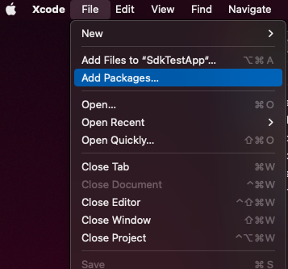
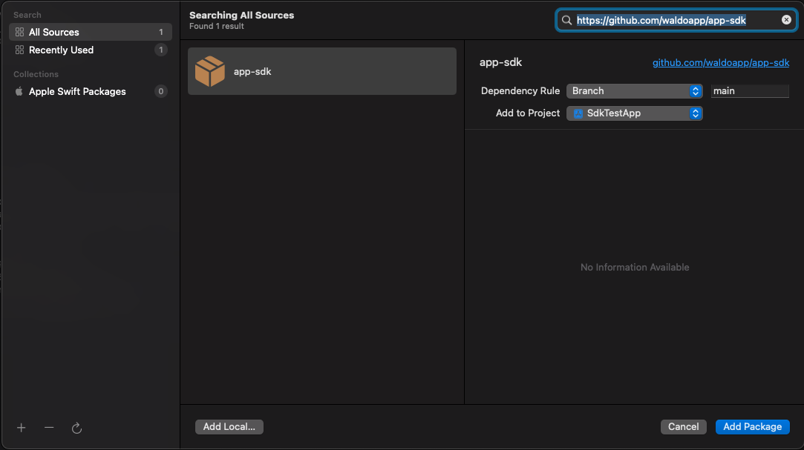
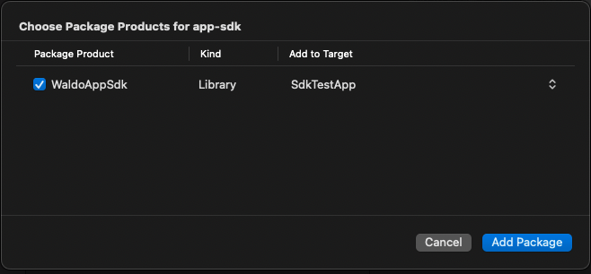

# iOS

## Usage

1. Open the packages view in XCode <br />
  
2. Add the package using the url `https://github.com/waldoapp/app-sdk` <br />
  
3. Choose the single product `WaldoAppSdk` <br />
  
4. Start using the SDK <br />
   ```swift
   import StoreKit
   import WaldoAppSdk

   func showStoreReviewController(windowScene: UIWindowScene) {
       if isInsideWaldo() {
           // Don't request AppStore review during UI tests
           return
       }

       SKStoreReviewController.requestReview(in: windowScene)
   }
   ```

## Publishing a release

Create a tag named `X.Y.Z` and push it to the repository. Then create a release on the tag.

```bash
export IOS_VERSION=X.Y.Z
git tag $IOS_VERSION
git push origin $IOS_VERSION

gh release create $IOS_VERSION --title "iOS $IOS_VERSION" --notes ""
```

# Android

## Usage

TODO

## Publishing a release

Create a tag named `android/vX.Y.Z` and push it to the repository. Then create a release on the tag. The CI will publish the maven package to the GitHub package registry.

```bash
export ANDROID_VERSION=X.Y.Z
git tag android/v$ANDROID_VERSION
git push origin android/v$ANDROID_VERSION

gh release create android/v$ANDROID_VERSION --title "Android $ANDROID_VERSION" --notes ""
```